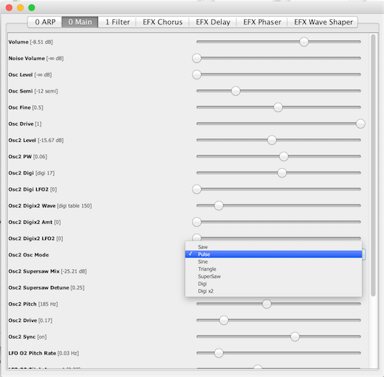

#norsez-dsp-kit
A DSP (Digital Signal Processing) synthesizer building blocks written entirely in Java. Use it as a kit to make your own synthesizers.

##Note
Sorry, this repo is admitted in a very messy non-open-source-oriented state. Fork it and use it at your own risk. I'll try to reorganize it a bit for easier navigation. But no promises. This repo is for the sake of my own historical backup more than anything. :)

##About this DSP kit
This API provides Java building blocks for you to make your own DSP synthesizer in Java. This project started in 1999 in C and C++, and went through numerous rewrites over the years. All development kinda came to a halt in 2004.

Originally, I made this kit in order to experiment with synth coding as I was working on free VST synths at the time (OnkotVST, SukreepVST, etc.)  A large part of this API is based on what I learned from the music-dsp mailing list and CSound. They were massive resources of audio DSP. My thanks to contributors on music-dsp mailing list.

##How to use
As noted above, this API has not been made easy for public use. It will need a lot of refactoring before it starts to even make sense.

You should be able to clone this repo and create an Eclipse project over the repo root. I have two synth examples built with this dsp kit. You can run them with the `Run As` > `Java Application` menu in Eclipse.

- `MainSynthApp.java` - This sample is configured with a monophonic subtractive synth which features 
	- 2 osciallators 	
	- Anti-aliased sine,triangle, saw, PWM, supersaw, and digital wavetable waveforms
	- LP, HP, BP filter
	- Two ASDR envelops, two LFOs, 
	-  Delay, Chorus, Phaser, Low Shelf EQ, Waveshaper effects
	- 16 step arpeggiator
	

- `MainVstSynthApp.java` - This sample is configured with a synth that emulates a rain storm atmosphere. (I actually listened to it as I went to bed back then.) You may notice this class is very similar to MainSynthApp. It was written for use with a java->VST dll library which has since been discontinued. Anyhow, this example also demonstrates how to combine these blocks to make some noises.
	
	
##Runnable samples
 
I have compiled the above two examples into two runnable jars namely, `monolith.jar` and `rainstorm.jar` respectively. If you have JDK 6 (or better) installed on your machine, you should be able to click each of them to run without building them yourself, but do it at your own risk :)
	
	

  
